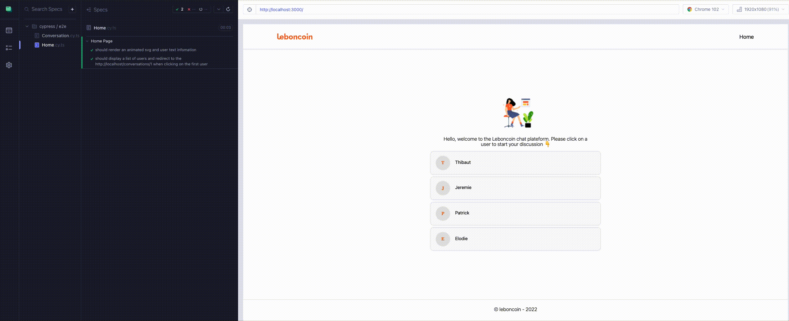
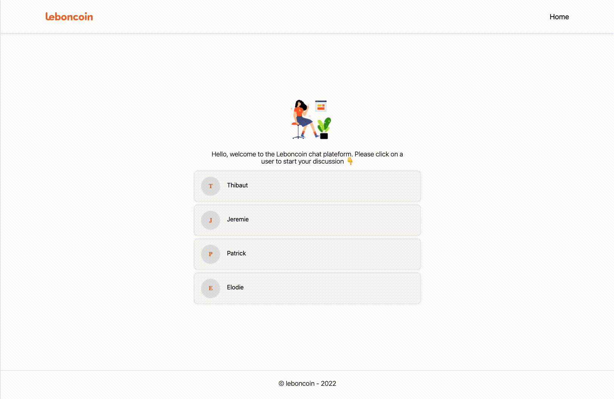

# Context :

At leboncoin, our users can share messages about a transaction, or ask for informations about any products.

Your job is to create the interface to consult those messages.
The interface needs to work on both desktop & mobile devices.

# Instructions 💡

Clone the repository and install dependencies

```bash
https://github.com/Puthpiseth/frontend-technical-test
cd frontend-technical-test

# Using npm or yarn
yarn install or npm install

```

# How to start the project 🚀

```bash

### Server side
yarn start-server

or

npm run start-server

### Client side
yarn dev

or

npm run dev
```

- Client side is running on http://localhost:3000
- Server side is running on https://localhost:3005

# Project Configuration ⚙️

From my experience, a team of developers have their own way of programming which may end up with different coding styles. We sometimes lose time in PRs for feedback.

As a teamwork, we want to make sure that all code is linted and formatted and has the same rules and styles before committing.

### 1. Eslint and Prettier

- The reason why I have decided to use [Eslint](https://eslint.org/) and [Prettier](https://prettier.io/) to solve this problem and to work better as team and keep our code clean.

### 2. Husky and commitlint

- Additionally, I have also used [husky](https://github.com/typicode/husky) and [commitlint](https://commitlint.js.org/#/). Everytime we commit a change, husky runs eslint against files that have been stagged to detect errors and fix formatting changes. On top of that, commitlint comes along to lint our commit messages, and abort if they don't respect commit message rules and convention.

# Technical Stack 📺

- [Nextjs with Typescript](https://nextjs.org/docs) for frontend
- [@emotion/react](https://emotion.sh/docs/@emotion/react) for styling
- [Redux with Typescript](https://redux.js.org/usage/usage-with-typescript) for state management
- [Cypress](https://docs.cypress.io/guides/overview/why-cypress) for End-to-End test

# State Management 🕸

I chose [Modern Redux with Redux Toolkit](https://redux.js.org/usage/usage-with-typescript) for the app's state management. I normally used [MobX]. To be honest, I have never used Redux before. I did it for this particular exercise. In terms of configuration and usage, I have found out that Modern Redux with Toolkit is quite simpler than MobX.

# How to test the app ? 🛠

You probably wonder which test, unit or integration or End-to-End tests, for my app. Well, based on my research, I decided to use [Cypress](https://docs.cypress.io/guides/overview/why-cypress) which is one of the best test automation tools out there. It is fast, reliable and easy to set up. I am amazed with real-time test reloading in browser so that I can see how users interact with the application.

- Live Automation Test with Cypress



# Conclusion

This test is quite challenging for me. I spent a fews days to learn [Nextjs](https://nextjs.org/docs), [Redux](https://redux.js.org/usage/usage-with-typescript) and [Cypress](https://docs.cypress.io/guides/overview/why-cypress) to be able to do this test. In total, I spent more than twenty hours for this test. As a result, I have made a lot of progress and I am ready 100% to join Leboncoin team.

# Live App 📽


#### Server Error 500 page


#### 404 Page


