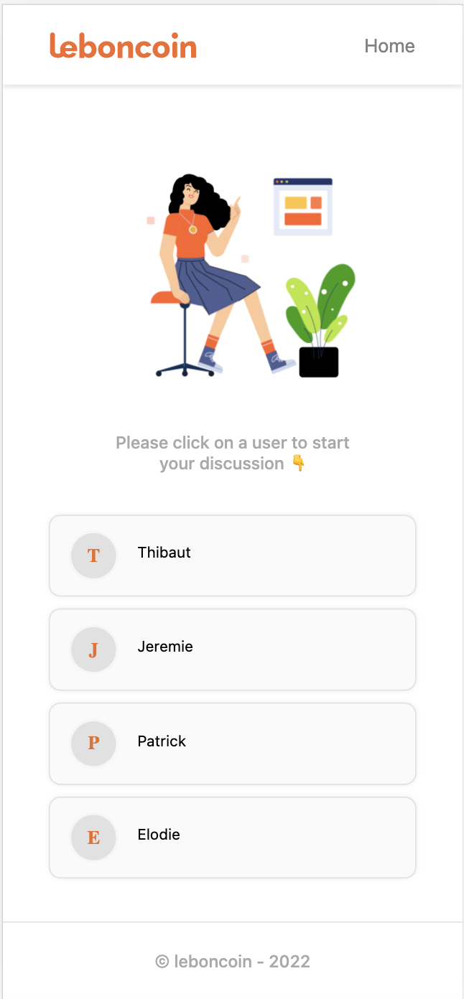

### Instructions

Clone the repository and install dependencies

```bash
https://github.com/Puthpiseth/frontend-technical-test
cd frontend-technical-test

# Using npm or yarn
yarn install or npm install

```

### How to start the project

```bash

### Server side
yarn start-server

or

npm run start-server

### Client side
yarn dev

or

npm run dev
```

Client side is running on http://localhost:3000
Server side is running on https://localhost:3005

### App screenshots

- Mobile
  - Home



- Desktop
  - Home


- Mobile
  - Conversation


- Mobile
  - Conversation


